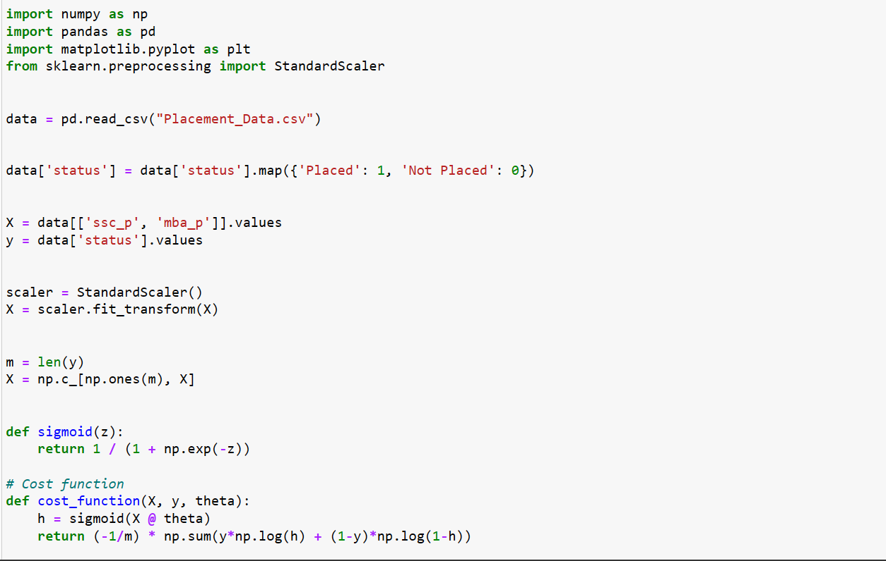
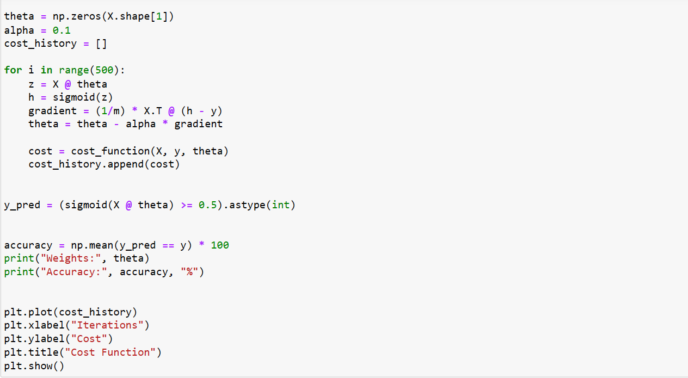
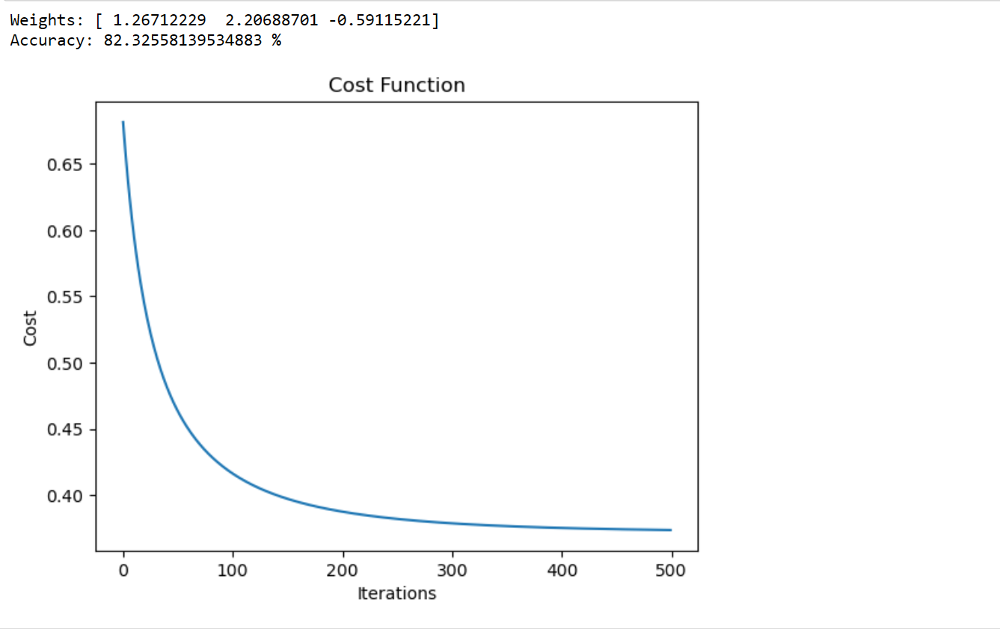

# Implementation-of-Logistic-Regression-Using-Gradient-Descent

## AIM:
To write a program to implement the the Logistic Regression Using Gradient Descent.

## Equipments Required:
1. Hardware – PCs
2. Anaconda – Python 3.7 Installation / Jupyter notebook

## Algorithm

1. Load and preprocess data (convert labels, select features)

2. Normalize features using StandardScaler and add bias column

3. Initialize theta and define sigmoid function

4. Apply gradient descent to update theta for given iterations

5. Predict output and calculate accuracy, then plot cost graph

## Program:
```
/*
Program to implement the the Logistic Regression Using Gradient Descent.

import numpy as np
import pandas as pd
import matplotlib.pyplot as plt
from sklearn.preprocessing import StandardScaler


data = pd.read_csv("Placement_Data.csv")


data['status'] = data['status'].map({'Placed': 1, 'Not Placed': 0})


X = data[['ssc_p', 'mba_p']].values
y = data['status'].values


scaler = StandardScaler()
X = scaler.fit_transform(X)


m = len(y)
X = np.c_[np.ones(m), X]


def sigmoid(z):
    return 1 / (1 + np.exp(-z))

# Cost function
def cost_function(X, y, theta):
    h = sigmoid(X @ theta)
    return (-1/m) * np.sum(y*np.log(h) + (1-y)*np.log(1-h))


theta = np.zeros(X.shape[1])
alpha = 0.1
cost_history = []

for i in range(500):
    z = X @ theta
    h = sigmoid(z)
    gradient = (1/m) * X.T @ (h - y)
    theta = theta - alpha * gradient
    
    cost = cost_function(X, y, theta)
    cost_history.append(cost)


y_pred = (sigmoid(X @ theta) >= 0.5).astype(int)


accuracy = np.mean(y_pred == y) * 100
print("Weights:", theta)
print("Accuracy:", accuracy, "%")


plt.plot(cost_history)
plt.xlabel("Iterations")
plt.ylabel("Cost")
plt.title("Cost Function")
plt.show()

Developed by: Swathi P N
RegisterNumber:  212225230279
*/
```

## Output:







## Result:
Thus the program to implement the the Logistic Regression Using Gradient Descent is written and verified using python programming.

